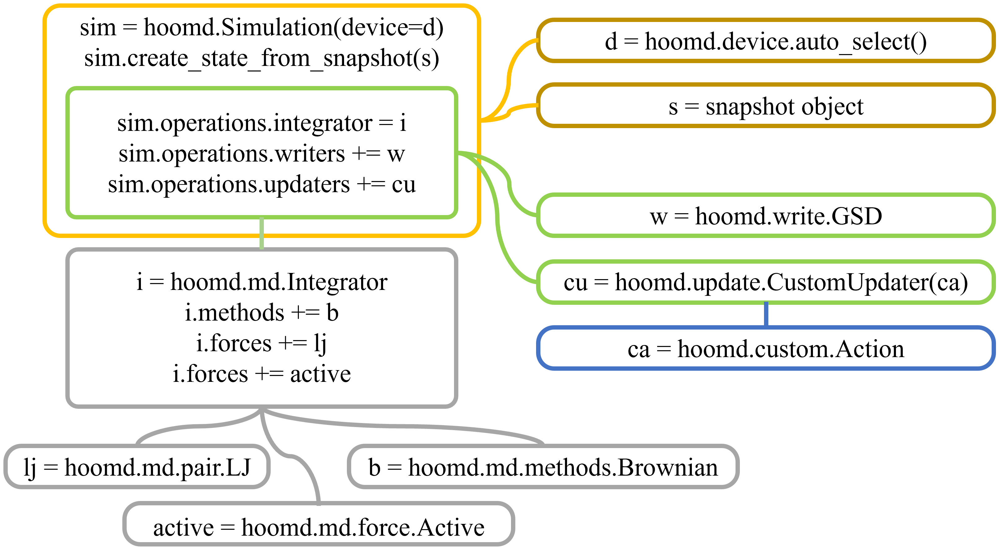
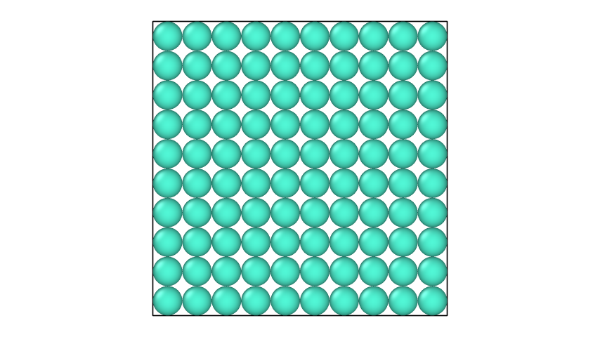
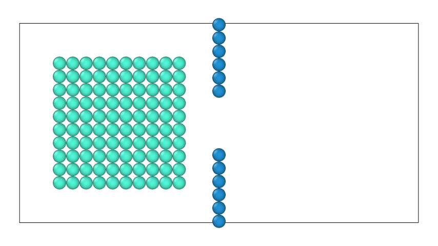
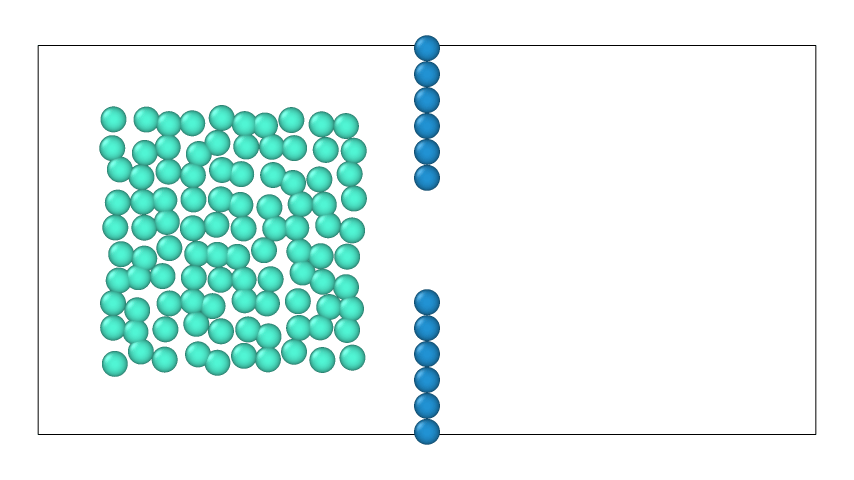

# What is HOOMD-blue

From the documentation,
>HOOMD-blue is a Python package that runs simulations of particle systems on CPUs and GPUs. It performs hard particle Monte Carlo simulations of a variety of shape classes and molecular dynamics simulations of particles with a range of pair, bond, angle, and other potentials. Many features are targeted at the soft matter research community, though the code is general and capable of many types of particle simulations.

The basic code structure of a HOOMD-blue simulation is shown in the diagram below.

>Original works by Grant Fourie [https://github.com/grantfourie/CrowdDynamics](https://github.com/grantfourie/CrowdDynamics)

In the next section, an example simulation script and the results will be shown.

## Example Simulation

For the sake of simplicity, we will be running a simulation of 2D system of 100 particles in Brownian motion in a square box. Then, we will expand on this to a system with a rectangular box with a wall in the middle with a small opening on the wall.

## Simulation script setup

### import necessary python packages

```python
##### import python packages
import hoomd
import gsd.hoomd
import numpy as np
import datetime, time
```

### helper functions that will display simulation progress

```python
##### helper functions to display simulation status
class print_sim_state(hoomd.custom.Action):
    def act(self, timestep):
        global init_time, last_output
        try:
            sec_remaining = int((self._state._simulation.final_timestep - timestep) / self._state._simulation.tps)
        except ZeroDivis/main_tutorial/ionError:
            sec_remaining = 0
        print(
            "Time", str(datetime.timedelta(seconds=int(time.time() - init_time))),
            "| Step:", timestep,
            "| TPS:", str(round(float(self._state._simulation.tps),3)),
            "| ETR:", str(datetime.timedelta(seconds=sec_remaining))
        )
        last_output = time.time()

class trigger_every_n_sec(hoomd.trigger.Trigger):
    def __init__(self):
        hoomd.trigger.Trigger.__init__(self)

    def compute(self, timestep):
        global last_output, update_every_n
        return ((time.time() - last_output) >=update_every_n)
```

### system parameters and environmental variables

```python
##### System variable definitions #####
sigma = 1     # sigma is diameter of particles
eps = 1       # epsilon is a constant affecting Lennard Jones function steepness/energy
kT = 1        # kT is the system thermal energy
dt = 1e-6     # dt is time step size
N = 100       # N is number of particles
```

### setting initial particle positions

```python
##### Setting initial particle positions #####
particlePositions = []     # Initializing an empty array to store particle positions
for i in range(10):        # Initialize square packing of 100 particles [10X10]
  for j in range(10):
    particlePositions.append([i-5+0.5, j-5+0.5, 0])
```

### set up initial snapshot of the simulation

```python
s = gsd.hoomd.Frame()                               # define initial frame
s.particles.N = N                                   # define number of particles
s.particles.position = particlePositions            # define initial positions
s.particles.typeid = ([0] * N)                      # give particles a type id (all particles are the same type here)
s.particles.types = ["A"]                           # define the types. only 1 type here
s.configuration.box = [10,10,0,0,0,0]               # [Width, Height, Length, x0, y0, z0]
with gsd.hoomd.open(name='IC.gsd', mode='w') as f:  # save the initial state as .gsd file
    f.append(s)
```

The image rendering of the initial snapshot is shown below.


### set up simulation object

```python
##### Setting up HOOMD simulation object
sim = hoomd.Simulation(                              # define simulation object and specify device and seed
    device=hoomd.device.auto_select(),
    seed=1
)
sim.create_state_from_gsd(filename='IC.gsd')         # load initial state

##### Setting up particle interactions #####
lj = hoomd.md.pair.LJ(                               # define lennard jones force
    nlist=hoomd.md.nlist.Cell(buffer=0.5),
    default_r_cut=0.75
)
lj.params[('A', 'A')] = dict(                        # define interaction between the particles type A.
    epsilon=eps,
    sigma=sigma
) 

sim.operations.integrator = hoomd.md.Integrator(     # define integrator
    dt = dt,                                         # time step size
    methods=[
        hoomd.md.methods.Brownian(                   # integrator method. you are most likely to be using either Brownian or Langevin. check documentation for details
            filter = hoomd.filter.All(),
            kT = 1 * kT,                             # system thermal energy
        )
    ],
    forces = [lj]
)

gsd_writer = hoomd.write.GSD(                        # specify the simulation output
    trigger = hoomd.trigger.Periodic(int(1e4)),      # log quantities every 1e4 time steps
    filename = "simulation1.gsd",                    # output file name
    mode = 'wb',                                     # writing mode. overwrite if exist
    filter = hoomd.filter.All(),                     # log quantities for all particles
    dynamic=['property', 'momentum', 'attribute']
)
sim.operations.writers.append(gsd_writer)

##### insert helper function #####
update_every_n = 5                                   # write simulation status every 5 seconds
sim.operations.writers.append(
    hoomd.write.CustomWriter(
        action = print_sim_state(),
        trigger = trigger_every_n_sec()
    )
)
```

### run the simulation

```python
##### Run simulation #####
init_time = time.time()                              # for helper function
last_output = init_time                              # for helper function
sim.run(1_000_000)                                   # run simulation for 5e6 number of time steps. since dt is 1e-6, the whole simulation will run for 5 unit time.
gsd_writer.flush()
```

The image rendering of the simulation is shown below.


### Second simulation

We will just modify the initial setup to get the initial snapshot of the second simulation with a rectangular box and a wall in the middle.

```python
##### Setting up initial state #####
prev_IC = gsd.hoomd.open(name="IC.gsd")[0]
s = gsd.hoomd.Frame()
s.configuration.box = [30,15,0,0,0,0]
current_positions = prev_IC.particles.position[:]
shifted_positions = current_positions - [7.5, 0, 0]

##### add a particle wall in the middle with a small opening #####
wall_particles = []
for i in range(16):
  if i < 6 or i > 9:
    wall_particles.append([0, i-15/2, 0])
s.particles.position = list(shifted_positions) + wall_particles
s.particles.N = N + len(wall_particles)
s.particles.typeid = ([0] * N + [1] * len(wall_particles))
s.particles.types = ["A", "W"]
with gsd.hoomd.open(name='IC2.gsd', mode='w') as f:
    f.append(s)
```

The image rendering of the initial snapshot is shown below.


### run longer simulation

```python
##### Setting up HOOMD simulation object (same setup so only commenting on changes) #####
sim = hoomd.Simulation(device=hoomd.device.auto_select(), seed=1)
sim.create_state_from_gsd(filename='IC2.gsd')

##### Setting up particle interactions #####
lj = hoomd.md.pair.LJ(
    nlist=hoomd.md.nlist.Cell(buffer=0.5),
    default_r_cut=0.75
)
lj.params[('A', 'A')] = dict(epsilon=eps, sigma=sigma)
lj.params[('A', 'W')] = dict(epsilon=eps, sigma=sigma)                          # walls have the same LJ interaction with the particles
lj.params[('W', 'W')] = dict(epsilon=0, sigma=sigma)                            # between walls, there's no interaction and thus 0 potential well depth

sim.operations.integrator = hoomd.md.Integrator(
    dt = dt,
    methods=[
        hoomd.md.methods.Brownian(
            filter = hoomd.filter.Type(['A']),                                  # walls are fixed and thus only the Brownian particles get integrated
            kT = 1 * kT,                                                        # system thermal energy let's increase it to 3 so that the particles move a bit faster
        )
    ],
    forces = [lj]
)
update_every_n = 10
sim.operations.writers.append(
    hoomd.write.CustomWriter(
        action = print_sim_state(),
        trigger = trigger_every_n_sec()
    )
)
gsd_writer = hoomd.write.GSD(
    trigger = hoomd.trigger.Periodic(int(1e4)),
    filename = "simulation2.gsd",
    mode = 'wb',
    filter = hoomd.filter.All(),
    dynamic=['property', 'momentum', 'attribute']
)
sim.operations.writers.append(gsd_writer)
##### Run simulation
init_time = time.time()
last_output = init_time
sim.run(10_000_000)
gsd_writer.flush()
```

The image rendering of the simulation is shown below.


`Original work by Jinhyun Lee`

`Updated by Jinhyun Lee on 2024-01-06`
